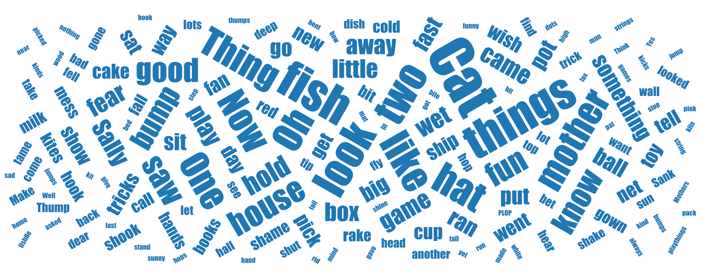
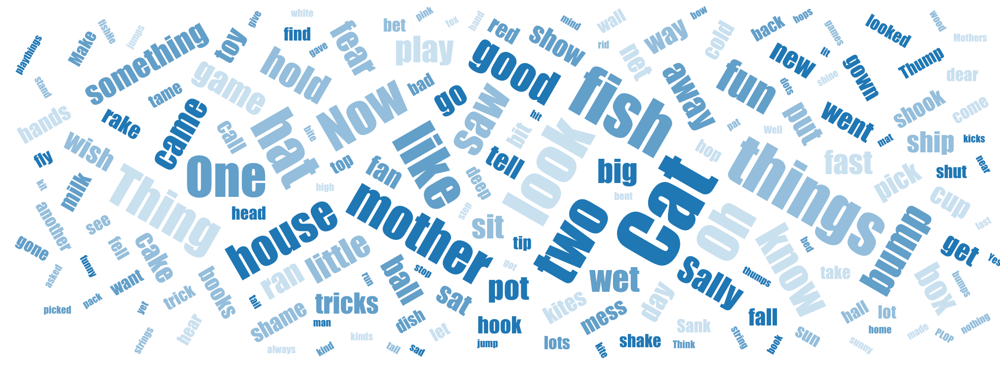

# vue-wordcloud

A Vue.js Word Cloud component based on the original [d3-cloud](https://github.com/jasondavies/d3-cloud) plugin.

**What's New?**

V1.1 Nov 25, 2018:

- Fix #6 add `showTooltip` option
- Fix #5 add support for custom color scales

V1.0.2 Aug 12, 2017:

- Additional font scale options
- Easy to use rotation setting

For details please refer to [options](https://github.com/feifang/vue-wordcloud#options).

### Install
```
npm install vue-wordcloud

```

### Import
```
import wordcloud from 'vue-wordcloud'
```

### Examples

Using D3 color scheme Category10:


Using single color of your choice, e.g. `['#1f77b4']`:



Using single-hue color of your choice, e.g. `['#1f77b4', '#629fc9', '#94bedb', '#c9e0ef']`:



Code:
```
<template>
  <div id="app">
      <wordcloud
      :data="defaultWords"
      nameKey="name"
      valueKey="value"
      :color="myColors"
      :showTooltip="true"
      :wordClick="wordClickHandler">
      </wordcloud>
  </div>
</template>

<script>
import wordcloud from 'vue-wordcloud'

export default {
  name: 'app',
  components: {
    wordcloud
  },
  methods: {
    wordClickHandler(name, value, vm) {
      console.log('wordClickHandler', name, value, vm);
    }
  },
  data() {
    return {
      myColors: ['#1f77b4', '#629fc9', '#94bedb', '#c9e0ef'],
      defaultWords: [{
          "name": "Cat",
          "value": 26
        },
        {
          "name": "fish",
          "value": 19
        },
        {
          "name": "things",
          "value": 18
        },
        {
          "name": "look",
          "value": 16
        },
        {
          "name": "two",
          "value": 15
        },
        {
          "name": "fun",
          "value": 9
        },
        {
          "name": "know",
          "value": 9
        },
        {
          "name": "good",
          "value": 9
        },
        {
          "name": "play",
          "value": 6
        }
      ]
    }
  }
}
</script>
```

For using [D3 categorical color schemes](https://github.com/d3/d3-scale-chromatic#categorical):
```
<template>
  <div id="app">
      <wordcloud
      :data="defaultWords"
      nameKey="name"
      valueKey="value"
      color="Accent">
      </wordcloud>
  </div>
</template>
```

### Options
**选项**|**简介**|**默认值**|**说明**
:-----:|:-----:|:-----:|:-----:
data|词云文本数据|defaultWords|数据格式：数组。数组中每个元素是对象{ 词：数值 }
nameKey|数据中表示要显示的词的字段名称|'name'|-
valueKey|数据中表示词的权重的字段名称|'value'|-
margin|图表外边矩|{top: 15, right: 15, bottom: 15, left: 15 }|-
wordPadding|词间间距|3|-
rotate|词的旋转角度|{from: -60, to: 60, numOfOrientation: 5 }|可设置角度范围及角度的个数
spiral|词的布局方式|'archimedian'|可选择'archimedian'或'rectangular'
fontScale|词的大小缩放比例|'sqrt'|可选择'sqrt'，'log'或'n'
fontSize|词的字号范围| `[10, 80]`| [minSize, maxSize]
font|词的字体名称，对应 `font-family` 的值 |"impact"|例如，衬线字体'serif'，非衬线字体'Arial'
color|配色集合，可配置两种类型的值：String (D3 scheme name)，或 Array（自定义的颜色列表）|'Category10'|可采用D3内置的任意 Category 配色，或自定义的颜色列表；单色可通过传入只有一个颜色的数组实现，详见 [examples](https://github.com/feifang/vue-wordcloud#examples)
showTooltip|显示 Tooltip|true| true/false; tooltip 的样式（如宽高、颜色等）可以通过 CSS 类 `div.tooltip` 配置
wordClick|词的点击事件的回调函数|null|函数传入三个变量，第一个是点击的词 `text`，第二个是该词对应的权重 `value`，第三个是 Vue 实例 `vm`


### Todo
- minimize component
- add formatter option for tooltip
- support D3 V5
