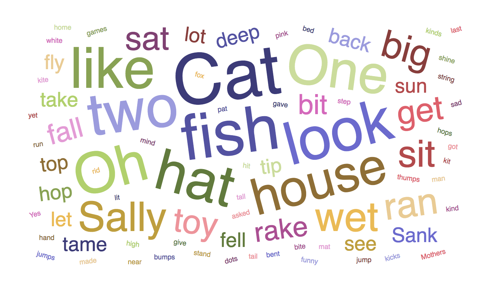

# vue-wordcloud

> A Vue.js Word Cloud component

### Install
```
npm install vue-wordcloud

```

### Import
```
import wordcloud from 'vue-wordcloud'
```

### Example



Code:
```
<template>
  <div id="app">
      <wordcloud
      :data="defaultWords"
      nameKey="name"
      valueKey="value">
      </wordcloud>
  </div>
</template>

<script>
import wordcloud from 'vue-wordcloud'

export default {
  name: 'app',
  components: {
    wordcloud
  },
  data() {
    return {
      defaultWords: [{
          "name": "Cat",
          "value": 26
        },
        {
          "name": "fish",
          "value": 19
        },
        {
          "name": "things",
          "value": 18
        },
        {
          "name": "look",
          "value": 16
        },
        {
          "name": "two",
          "value": 15
        },
        {
          "name": "fun",
          "value": 9
        },
        {
          "name": "know",
          "value": 9
        },
        {
          "name": "good",
          "value": 9
        },
        {
          "name": "play",
          "value": 6
        }
      ]
    }
  }
}
</script>
```
### Options
**选项**|**简介**|**默认值**|**说明**
:-----:|:-----:|:-----:|:-----:
data|词云文本数据|defaultWords|数据格式：数组。数组中每个元素是对象{ 词：数值 }
margin|图表外边矩|{top: 15, right: 15, bottom: 15, left: 15 }|-
wordPadding|词间间距|3|-
rotate|词的旋转角度|{from: -60, to: 60, numOfOrientation: 5 }|可设置角度范围及角度的个数
spiral|词的布局方式|‘archimedian’|可选择”archimedian”或”rectangular”
fontScale|词的大小缩放比例|‘sqrt’|可选择”sqrt”，”log”或”n”
color|配色集合|‘Category20b’|可采用D3内置的任意配色
